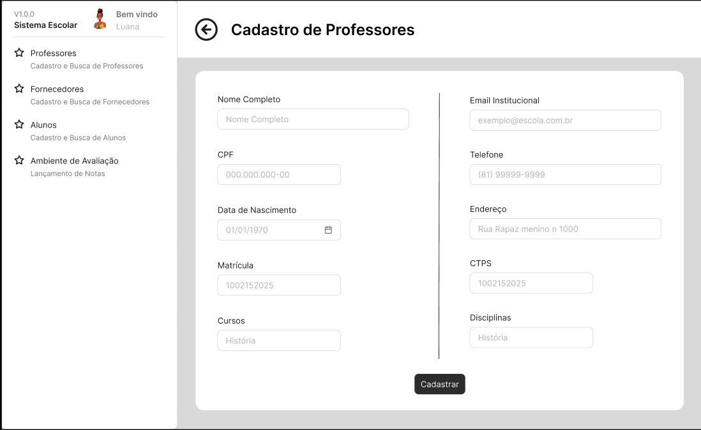
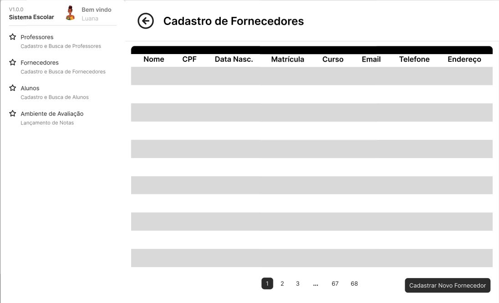
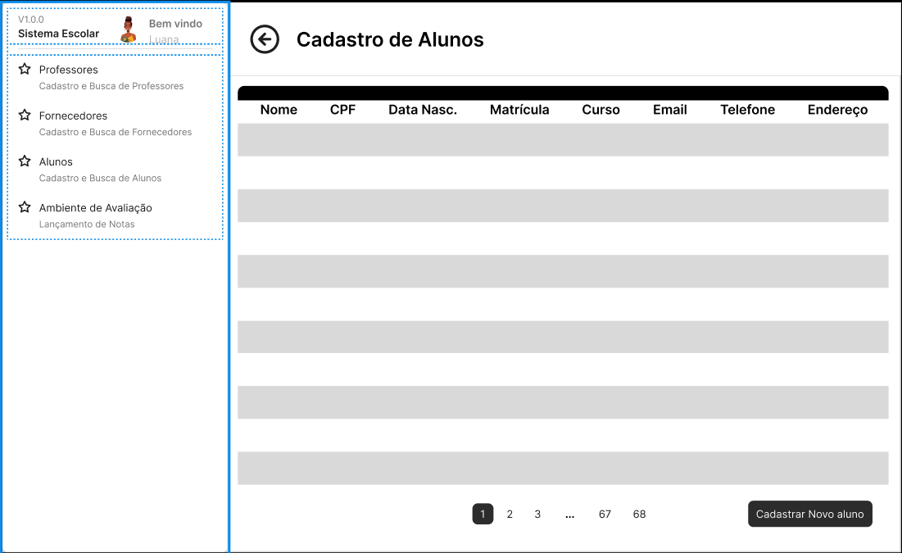
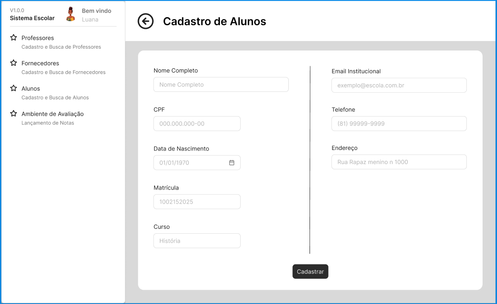
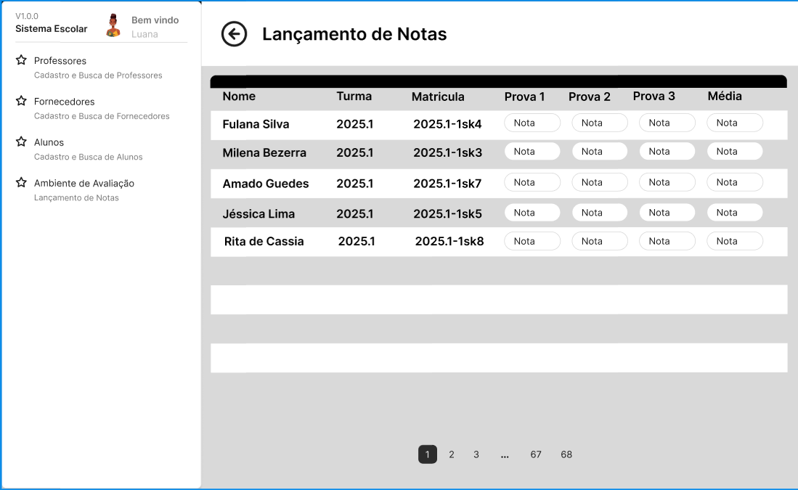
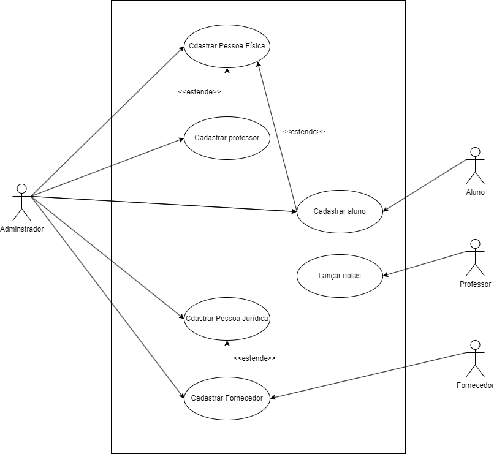
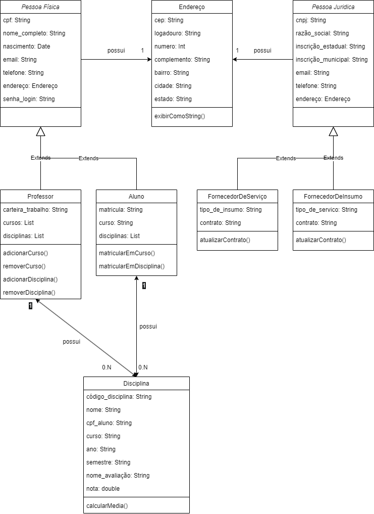

# **Projeto Integrador III - SENAC**

---

## **Introdução**

Este repositório contém a documentação e os protótipos da **segunda entrega** do Projeto Integrador III do curso de **Tecnologia em Análise e Desenvolvimento de Sistemas** do SENAC. O projeto consiste na **modelagem e implementação de um sistema orientado a objetos**, abrangendo funcionalidades essenciais como:

- **Cadastro de Pessoas Físicas e Jurídicas**
- **Cadastro de Professores, Fornecedores e Alunos**
- **Lançamento de Notas Acadêmicas**

A prototipação foi realizada com base na modelagem de **casos de uso e diagramas UML** desenvolvidos na primeira fase do projeto.

---

## **Estrutura do Repositório**

```
📜 README.md      -> Documentação principal do projeto  
📁 prototipos/    -> Protótipos das interfaces desenvolvidas  
📁 diagramas/     -> Diagramas de caso de uso e classes  
📁 codigo/        -> Código-fonte da aplicação  
```

---


## **Protótipos**

Os protótipos foram desenvolvidos para representar as principais funcionalidades do sistema. Cada interface foi projetada com base nos diagramas elaborados na primeira fase do projeto.

### **Interface Interativa no Figma**
E necessário ter uma conta no figma para vizualizar o protótipo interativo da interface, disponível no link a seguir.

[Clique aqui acesse o protótipo interativo](https://www.figma.com/proto/0FBw617EsrRqKlWKODjuj0/Sistema-Escolar?node-id=24-610&p=f&t=P17sZMwCagXx2Q1r-1&scaling=scale-down&content-scaling=fixed&page-id=0%3A1&starting-point-node-id=24%3A610https://www.figma.com/proto/0FBw617EsrRqKlWKODjuj0/Sistema-Escolar?node-id=24-610&p=f&t=P17sZMwCagXx2Q1r-1&scaling=scale-down&content-scaling=fixed&page-id=0%3A1&starting-point-node-id=24%3A610)

### **Interfaces Desenvolvidas**

#### Tela Inicial


#### Cadastro de Professores



#### Cadastro de Fornecedores



#### Cadastro de Alunos



#### Lançamento de Notas


---

## **Diagramas**

Os diagramas representam a modelagem do sistema utilizando a **UML**. Eles incluem os diagramas de **caso de uso e classes** desenvolvidos na primeira fase do projeto.


# Diagrama de Casos de Uso


# Diagrama de Classes



---

## **Como Contribuir**

```bash
# Faça um fork deste repositório
git fork

# Clone o repositório para sua máquina local
git clone https://github.com/filipechgs/projeto_integrador_senac_poo_abfjlv.git

# Crie uma branch para suas alterações
git checkout -b minha-branch

# Faça commit das alterações
git commit -m 'Minha contribuição'

# Envie para o repositório
git push origin minha-branch

# Abra um Pull Request
```

---

## **Requisitos Técnicos**

- Ferramentas de prototipação: **Figma/Miro**
- Tecnologias para desenvolvimento (Opcional): **HTML, CSS, Java (backend)**
- Repositório **GitHub** para controle de versão

---

## **Licença**

Este projeto é de **uso acadêmico** e segue as diretrizes estabelecidas pela instituição **SENAC**.
